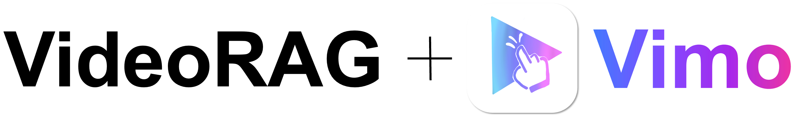
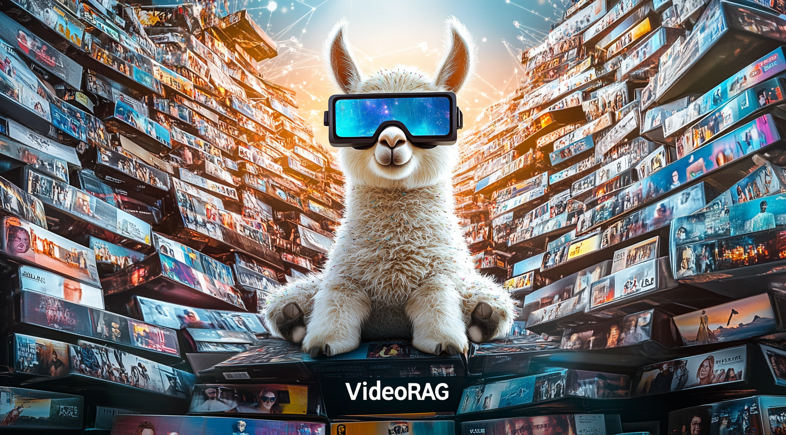
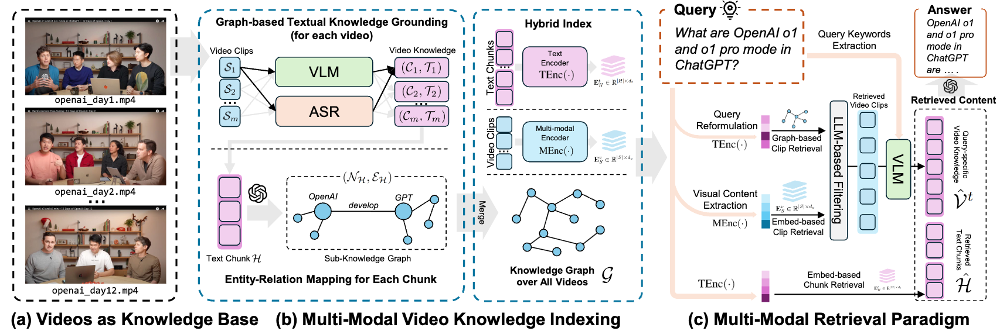
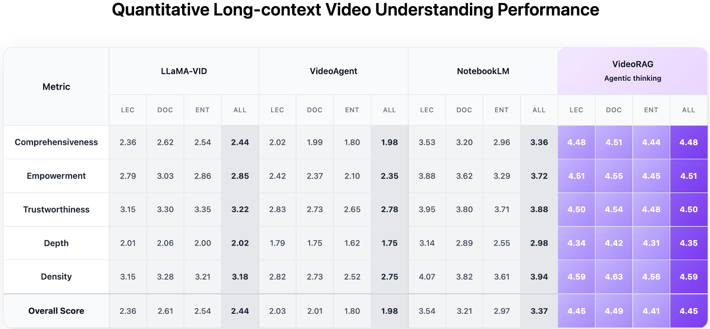

# VideoRAG Software Quality Testing Project

> [!IMPORTANT]
>
> ## Course Project Notice
>
> This repository is a **university course project** based on the open-source project **VideoRAG / Vimo** developed by **HKUDS**.
>
> * **Course:** 软件质量测试
> * **Our repository:** https://github.com/series181200/test-videorag
> * **Original repository:** https://github.com/HKUDS/VideoRAG
> * **Original project:** VideoRAG: Chat with Your Videos
> * **Purpose:** Software testing, learning, research, and course assessment
>
> This repository is independently maintained by our course project team and is **not an official repository of HKUDS or the original VideoRAG authors**.
>
> The source code imported from the original VideoRAG repository remains the work of its original authors and contributors. Our team's own work is represented by the commits made **after the initial import**, including testing code, bug fixes, test reports, documentation, quality analysis, and other modifications.

---

## 👥 Course Project Team


| Member | Main Responsibilities                        |
| ------ | -------------------------------------------- |
| 李科橙 | Software testing, development, documentation |
| 丁锦威 | Software testing, development, documentation |

> Team members should configure their own Git `user.name` and `user.email` before committing so that individual contributions can be identified through the Git history.

---

## 🧪 Our Course Project Work

This project focuses on the **software quality assurance and testing** of VideoRAG.

Our work may include:

* Environment deployment and reproducibility testing
* Functional testing
* Unit testing
* Integration testing
* System testing
* Interface/API testing
* Performance testing
* Compatibility testing
* Robustness and exception testing
* Automated testing
* Code quality analysis
* Bug identification and debugging
* Test case design
* Test report preparation
* Documentation improvements
* Necessary code modifications related to testing

As the course project progresses, this section will be updated with the actual work completed by the team.

### Contribution Tracking

Individual contributions are recorded through Git commits.

For example:

```bash
git log --pretty=format:"%h | %an <%ae> | %ad | %s" --date=short
```

The first commit:

```text
cc2519b Initial import of VideoRAG
```

represents the import of the original upstream VideoRAG source code and **should not be regarded as independently developed work by our team**.

Subsequent commits represent modifications and contributions made during this course project.

---


# Vimo 四层统一测试

统一入口会依次执行：

1. `test_renderer`：全部 Vitest + jsdom 前端用例。
2. `test_communication/filtered`：筛选后的 Vitest 通信用例。
3. `test_videorag_api`：全部 pytest API 用例。
4. `test_videorag_algorithm/filtered`：筛选后的 pytest 算法用例。

每条用例在终端输出测试层级、测试接口或函数、`OK/NG` 和发现的问题。某一层失败后，后续层仍会继续运行。

四个测试层只使用两种框架：TypeScript 使用 Vitest，Python 使用 pytest。

## 首次安装依赖

在 `Vimo-desktop` 根目录执行：

```powershell
python -m pip install -r requirements-unified-tests.txt
npm.cmd install --prefix test_renderer
npm.cmd install --prefix test_communication
```

如果终端无法直接识别 `python`，请把上面第一条中的 `python` 换成实际解释器路径；例如本机可用
`C:\ProgramData\miniconda3\python.exe`。批处理启动时会依次尝试当前 Conda 环境、PATH 中的
Python、该 Miniconda 路径和 Windows `py` 启动器。

## 一键运行

双击：

```text
run_all_layer_tests.bat
```

或者在终端执行：

```powershell
python run_all_layer_tests.py
```

如果需要指定 Conda 环境，可以先设置：

```powershell
$env:VIMO_TEST_PYTHON = "D:\develop\conda_envs\your_env\python.exe"
.\run_all_layer_tests.bat
```

renderer 测试直接加载 React 源码并在 jsdom 中执行，不再依赖 Playwright、Chromium 或根目录的 pnpm `node_modules`。框架或 Python 依赖缺失时，该层用例会显示为 NG，并明确标记为测试环境问题而不是业务漏洞。

## 分层单独运行

```powershell
test_renderer\node_modules\.bin\vitest.cmd run --config test_renderer\vitest.config.ts
test_communication\node_modules\.bin\vitest.cmd run --config test_communication\filtered\vitest.config.ts
python -m pytest -c test_videorag_api\pytest.ini test_videorag_api\tests
python -m pytest -c test_videorag_algorithm\filtered\pytest.ini test_videorag_algorithm\filtered
```


## 📜 License and Attribution

This project is derived from:

**VideoRAG: Chat with Your Videos**
Developed by the VideoRAG@HKUDS team
Original repository: https://github.com/HKUDS/VideoRAG

The original `LICENSE` file is retained in this repository.

Original VideoRAG code, third-party components, models, and dependencies remain subject to their respective licenses and copyright terms.

This repository is intended for **non-commercial educational and research use** as part of a university course project.

Copyright in the original VideoRAG materials remains with the respective original copyright holders.

Copyright in independently created modifications belongs to the respective contributors, subject to the applicable licenses of the original project and its dependencies.

If this repository or the original VideoRAG project is used in academic work, please cite the original VideoRAG paper shown in the Citation section below.

---

# Original VideoRAG / Vimo Project

> The following sections describe the original VideoRAG / Vimo project and are retained for attribution, documentation, reproduction, and research reference.

<div align="center">

<picture>
    
  </picture>

<h1>
    <strong>VideoRAG: Chat with Your Videos</strong> • <strong>Vimo Desktop</strong>
  </h1>

<a href="https://trendshift.io/repositories/16146" target="_blank">
    
  </a>

<a href="https://arxiv.org/abs/2502.01549">
    
  </a>

<a href="https://github.com/HKUDS/VideoRAG/issues/1">
    
  </a>

<a href="https://discord.gg/ZzU55kz3">
    
  </a>

<a href="https://www.youtube.com/watch?v=D5vsxcp4QZI">
    
  </a>

<a href="https://learnopencv.com/videorag-long-context-video-comprehension/">
    
  </a>


**🎬 Intelligent Video Conversations | Powered by Advanced AI | Extreme Long-Context Processing**

</div>

<br/>



Vimo is a revolutionary desktop application that lets you **chat with your videos** using cutting-edge AI technology. Built on the powerful [VideoRAG framework](https://arxiv.org/abs/2502.01549), Vimo can understand and analyze videos of any length — from short clips to hundreds of hours of content — and answer your questions with remarkable accuracy.

## 🎥 Watch Vimo in Action

See how Vimo transforms video interaction with intelligent conversations and deep understanding capabilities.

<div align="center">

<a href="https://www.youtube.com/watch?v=D5vsxcp4QZI">
    
  </a>

<p><em>👆 Click to watch the Vimo demo video</em></p>

</div>

## ✨ Key Features

### For Everyone

* **Drag & Drop Upload**: Simply drag video files into Vimo
* **Smart Conversations**: Ask questions in natural language
* **Multi-Format Support**: Works with MP4, MKV, AVI, and more
* **Cross-Platform**: Available on macOS, Windows, and Linux

### For Power Users

* **Extreme Long Videos**: Process videos up to hundreds of hours
* **Multi-Video Analysis**: Compare and analyze multiple videos simultaneously
* **Advanced Retrieval**: Find specific moments and scenes with precision
* **Export Capabilities**: Save insights and references for later use

### For Researchers

* **VideoRAG Framework**: Access to cutting-edge retrieval-augmented generation
* **Benchmark Dataset**: LongerVideos benchmark with 134+ hours of content
* **Performance Metrics**: Detailed evaluation against existing methods
* **Extensible Architecture**: Build upon the open-source foundation

## 🌟 Why Vimo?

### For Video Enthusiasts & Professionals

* **Effortless Video Analysis**: Upload any video and start asking questions immediately
* **Natural Conversations**: Chat with your videos as if talking to a human expert
* **No Length Limits**: Process everything from 30-second clips to 100+ hour documentaries
* **Deep Understanding**: Combines visual content, audio, and context for comprehensive answers

### For Researchers & Developers

* **State-of-the-Art Algorithm**: Built on VideoRAG, featuring graph-driven knowledge indexing
* **Benchmark Performance**: Evaluated on 134+ hours across lectures, documentaries, and entertainment
* **Open Source**: Full access to VideoRAG implementation and research findings
* **Scalable Architecture**: Efficient processing with single GPU (RTX 3090) capability

## 📋 Table of Contents

* [🚀 Quick Start](#-quick-start-of-vimo)
* [✨ Key Features](#-key-features)
* [🔬 VideoRAG Algorithm](#-videorag-algorithm)
* [🧪 LongerVideos Benchmark](#-longervideos-benchmark)
* [📖 Citation](#-citation)
* [🤝 Contributing](#-contributing)
* [🙏 Acknowledgement](#-acknowledgement)

## 🚀 Quick Start of Vimo

### Option 1: Download Vimo App (Coming Soon)

> [!NOTE]
> The original VideoRAG project is preparing the **Beta release** for macOS Apple Silicon first, with Windows and Linux versions coming later.

<div align="left">

<a href="https://github.com/HKUDS/Vimo/releases">
    
  </a>

</div>

### Option 2: Run from Source Code

For detailed setup instructions:

* **Vimo Desktop App**: See [Vimo-desktop](Vimo-desktop) for complete installation and configuration steps

**Quick Overview:**

1. Set up the Python backend environment and start the VideoRAG server
2. Launch the Electron frontend application
3. Start chatting with your videos

## 🔬 VideoRAG Algorithm

<p align="center">
  
</p>

VideoRAG introduces a novel dual-channel architecture that combines:

* **Graph-Driven Knowledge Indexing**: Multi-modal knowledge graphs for structured video understanding
* **Hierarchical Context Encoding**: Preserves spatiotemporal visual patterns across long sequences
* **Adaptive Retrieval**: Dynamic retrieval mechanisms optimized for video content
* **Cross-Video Understanding**: Semantic relationship modeling across multiple videos

### Technical Highlights

* **Efficient Processing**: Handle hundreds of hours on a single RTX 3090 (24GB)
* **Structured Indexing**: Distill long videos into concise knowledge representations
* **Multi-Modal Retrieval**: Align textual queries with visual and audio content
* **LongerVideos Benchmark**: 160+ videos, 134+ hours across diverse domains

### Performance Comparison

The original VideoRAG project reports significant improvements in long-context video understanding:

<div align="center">



</div>

The original project also evaluates VideoRAG's QA performance on the Video-MME long video track:


| Video-MME Long Video | MiniCPM-o w/o subs | MiniCPM-o w/ subs | MiniCPM-V w/o subs | MiniCPM-V w/ subs |  VideoRAG |
| -------------------- | -----------------: | ----------------: | -----------------: | ----------------: | --------: |
| Accuracy             |              52.2% |             56.3% |              51.8% |             56.3% | **60.2%** |

> Note: The score may show slight fluctuations across runs due to the instability of LLM generation.

### Experiments and Evaluation

See [VideoRAG-algorithm](VideoRAG-algorithm) for detailed development setup including:

* Conda environment creation
* Model checkpoints download
* Dependencies installation
* Evaluation scripts

## 🧪 LongerVideos Benchmark

The original VideoRAG project created the LongerVideos benchmark to evaluate long-context video understanding:


| Video Type        | #Collections | #Videos | #Queries | Avg. Duration |
| ----------------- | -----------: | ------: | -------: | ------------: |
| **Lectures**      |           12 |     135 |      376 |   ~64.3 hours |
| **Documentaries** |            5 |      12 |      114 |   ~28.5 hours |
| **Entertainment** |            5 |      17 |      112 |   ~41.9 hours |
| **Total**         |           22 |     164 |      602 |  ~134.6 hours |

For detailed evaluation instructions and reproduction scripts, see [VideoRAG-algorithm/reproduce](VideoRAG-algorithm/reproduce).

## 📖 Citation

If you use VideoRAG or Vimo in research, coursework, reports, or publications, please cite the original paper:

```bibtex
@article{VideoRAG,
  title={VideoRAG: Retrieval-Augmented Generation with Extreme Long-Context Videos},
  author={Ren, Xubin and Xu, Lingrui and Xia, Long and Wang, Shuaiqiang and Yin, Dawei and Huang, Chao},
  journal={arXiv preprint arXiv:2502.01549},
  year={2025}
}
```

When referring to this course repository specifically, please make it clear that it is a student-maintained derivative repository based on the original HKUDS VideoRAG project.

## 🤝 Contributing

### Course Project Contributions

Members of this course project should:

1. Configure their own Git identity:

```bash
git config user.name "Your Name"
git config user.email "your-github-email@example.com"
```

2. Synchronize the latest code before development:

```bash
git pull --rebase origin main
```

3. Make focused changes.
4. Commit using clear messages, for example:

```bash
git add .
git commit -m "test: add video upload boundary tests"
git push origin main
```

Recommended commit message prefixes include:

```text
test:  testing-related changes
fix:   bug fixes
feat:  new functionality
docs:  documentation
refactor: code restructuring
perf:  performance-related changes
chore: maintenance work
```

Each team member should commit their own work using their own Git identity so that personal contributions remain visible in the project history.

### Upstream VideoRAG Contributions

For issues or contributions intended for the original VideoRAG project rather than this course repository, please refer to:

https://github.com/HKUDS/VideoRAG

## 🙏 Acknowledgement

This course project is built upon the work of the original VideoRAG project and the broader open-source community.

The original project acknowledges:

* **[VideoRAG](https://arxiv.org/abs/2502.01549)**: The core algorithm powering Vimo's intelligence
* **[nano-graphrag](https://github.com/gusye1234/nano-graphrag)** & **[LightRAG](https://github.com/HKUDS/LightRAG)**: Graph-based retrieval foundations
* **[ImageBind](https://github.com/facebookresearch/ImageBind)**: Multi-modal representation learning
* **[uitars-desktop](https://github.com/bytedance/UI-TARS-desktop)**: Desktop application architecture inspiration

We sincerely thank the **VideoRAG@HKUDS team** and all upstream open-source contributors for making their work available to the research and developer community.

---

<div align="center">

<sub>
    Course project maintained by 李科橙 and project team.<br/>
    Based on VideoRAG / Vimo by the VideoRAG@HKUDS team.
  </sub>

</div>
